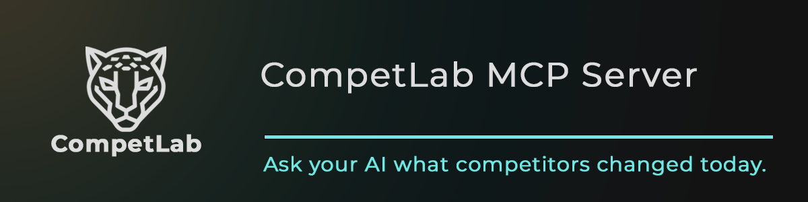

<p align="center">
  
</p>

# CompetLab MCP Server

[](https://modelcontextprotocol.io)
[](https://www.typescriptlang.org/)
[](https://opensource.org/licenses/MIT)
[](#available-tools)

[](https://glama.ai/mcp/servers/competlab/competlab-mcp-server)

> Competitive intelligence for AI agents — see where AI sends your buyers, and what to do about it.

More B2B buyers are asking AI before they Google. CompetLab monitors competitors across 6 dimensions — including **AI Visibility**, which tracks which brands ChatGPT, Claude, Gemini, Perplexity and Google AI Overviews recommend, and **AI Sources**, the pages Perplexity and Google AI Overviews read when they answer your buyers' questions. This MCP server gives your AI agent access to all of it: dashboards, historical data, alerts, and the Strategic Briefing. No other CI platform does this.

## Supported Clients

Works with any MCP-compatible client:

- [Claude Desktop](https://claude.ai/download) / [Claude Web](https://claude.ai)
- [Claude Code](https://docs.anthropic.com/en/docs/claude-code)
- [Cursor](https://cursor.com)
- [VS Code (Copilot)](https://code.visualstudio.com)
- [Windsurf](https://windsurf.com)
- [Cline](https://cline.bot)

## Quick Start

Two ways to connect — pick the one that fits your setup:

|               | Remote Server                                              | Local Server                          |
| ------------- | ---------------------------------------------------------- | ------------------------------------- |
| **Transport** | Streamable HTTP                                            | stdio                                 |
| **Setup**     | Zero install — just add URL                                | `npm install && npm run build`        |
| **Best for**  | Most users — Claude Code, Cursor, VS Code, Windsurf, Cline | Claude Desktop, Glama, or offline use |

Get your API key: [app.competlab.com](https://app.competlab.com/register) > Organization Settings > API Keys

### Option 1: Remote Server (recommended)

**Server URL:** `https://mcp.competlab.com/mcp`
**Auth:** API key via `CL-API-Key` header (or `api_key` query parameter)

#### Claude Code

```bash
claude mcp add --transport http \
  --header "CL-API-Key: YOUR_COMPETLAB_API_KEY" \
  competlab https://mcp.competlab.com/mcp
```

#### Cursor

Add to `.cursor/mcp.json`:

```json
{
  "mcpServers": {
    "competlab": {
      "url": "https://mcp.competlab.com/mcp",
      "headers": {
        "CL-API-Key": "YOUR_COMPETLAB_API_KEY"
      }
    }
  }
}
```

#### VS Code

Add to `.vscode/mcp.json`:

```json
{
  "inputs": [
    {
      "type": "promptString",
      "id": "competlab-api-key",
      "description": "CompetLab API Key (starts with cl_live_)",
      "password": true
    }
  ],
  "servers": {
    "competlab": {
      "type": "http",
      "url": "https://mcp.competlab.com/mcp",
      "headers": {
        "CL-API-Key": "${input:competlab-api-key}"
      }
    }
  }
}
```

> Note: VS Code uses `"servers"` (not `"mcpServers"`) and supports secure input prompts via `${input:id}`.

#### Windsurf

Add to `~/.codeium/windsurf/mcp_config.json`:

```json
{
  "mcpServers": {
    "competlab": {
      "serverUrl": "https://mcp.competlab.com/mcp",
      "headers": {
        "CL-API-Key": "YOUR_COMPETLAB_API_KEY"
      }
    }
  }
}
```

> Note: Windsurf uses `"serverUrl"` (not `"url"`).

#### Cline

Add to `cline_mcp_settings.json` (or configure via Cline UI > Installed > Advanced MCP Settings):

```json
{
  "mcpServers": {
    "competlab": {
      "url": "https://mcp.competlab.com/mcp",
      "headers": {
        "CL-API-Key": "YOUR_COMPETLAB_API_KEY"
      },
      "disabled": false
    }
  }
}
```

#### Claude Desktop / Claude Web

Claude Desktop and Claude Web only support URL-based auth (no custom headers). Use the `api_key` query parameter:

Go to **Settings > MCP** and add the server with this URL:

```
https://mcp.competlab.com/mcp?api_key=YOUR_COMPETLAB_API_KEY
```

### Option 2: Local Server (stdio)

Run the server locally via stdin/stdout. Useful for Claude Desktop, Glama, or environments that prefer stdio transport.

```bash
git clone https://github.com/competlab/competlab-mcp-server.git
cd competlab-mcp-server
npm install
npm run build
```

#### Claude Code

```bash
claude mcp add --transport stdio \
  --env COMPETLAB_API_KEY=YOUR_COMPETLAB_API_KEY \
  competlab node dist/index.js
```

#### Claude Desktop

Add to your Claude Desktop config (`claude_desktop_config.json`):

```json
{
  "mcpServers": {
    "competlab": {
      "command": "node",
      "args": ["dist/index.js"],
      "cwd": "/path/to/competlab-mcp-server",
      "env": {
        "COMPETLAB_API_KEY": "YOUR_COMPETLAB_API_KEY"
      }
    }
  }
}
```

#### Generic stdio

```bash
COMPETLAB_API_KEY=YOUR_COMPETLAB_API_KEY node dist/index.js
```

The server reads JSON-RPC from stdin and writes responses to stdout.

See [examples/](./examples/) for ready-to-paste config files for each client.

## What is CompetLab?

Competitive intelligence for the AI era: 14 dimensions — 6 monitored continuously, plus 8 leading-edge dimensions researched for the monthly Strategic Briefing. The six monitored dimensions:

| Dimension         | What It Tracks                                                                                                                             |
| ----------------- | ------------------------------------------------------------------------------------------------------------------------------------------ |
| **AI Visibility** | Which companies ChatGPT, Claude, Gemini, Perplexity and Google AI Overviews recommend in your category, how often each is named, and where you stand |
| **AI Sources**    | The pages Perplexity and Google AI Overviews read when they answer your buyers' questions, and whether you are on them                   |
| **Positioning**   | Homepage messaging, value props, CTAs, target audience, differentiators                                                                    |
| **Pricing**       | Plans, billing models, free tiers, market pricing statistics, gap analysis                                                                 |
| **Content**       | Sitemap analysis, content categorization (12 categories), URL changelog, content gaps                                                      |
| **Tech & Trust**  | Tech stacks, security headers (grade A-F), trust signals (26 signals in 5 categories), per-assistant AI access                            |

AI Visibility is what makes CompetLab unique — no other CI platform tracks which brands AI models recommend. AI Sources is its companion: the pages Perplexity and Google AI Overviews retrieve on the way to those answers, and whether they name you.

> [Start free trial](https://app.competlab.com/register) (14 days, no credit card) | [Learn more](https://competlab.com)

## Available Tools

**38 tools.** 35 are read-only; 3 are async-scan starters that create a scan record (`start_tech_stack_scan`, `start_trust_signals_scan`, `start_agent_adoption_scan`).

### Projects & Competitors

| Tool               | Description                                                                   |
| ------------------ | ----------------------------------------------------------------------------- |
| `list_projects`    | List all projects with status, competitor count, and last monitored timestamp |
| `get_project`      | Get project details with per-dimension monitoring freshness                   |
| `list_competitors` | List all monitored competitors (includes your own domain for comparison)      |
| `get_competitor`   | Get competitor details including monitored page URLs                          |

### AI Visibility

| Tool                             | Description                                                                                                                                                                  |
| -------------------------------- | ---------------------------------------------------------------------------------------------------------------------------------------------------------------------------- |
| `get_ai_visibility_dashboard`    | The market map — which companies the AI models recommend in your category, and whether you are one of them — with per-model breakdowns; optionally the models' raw answers |
| `get_ai_visibility_history`      | Paginated history of AI Visibility checks                                                                                                                                    |
| `get_ai_visibility_check_detail` | Full detail for one check, and optionally what each model actually said — filterable by competitor, model, or prompt                                                        |
| `get_ai_visibility_trend`        | How the market the AI models draw has moved over a window — each company's reading now and at the start, and the difference; readable per AI model                         |

### AI Sources

| Tool                          | Description                                                                                                                                                                  |
| ----------------------------- | ---------------------------------------------------------------------------------------------------------------------------------------------------------------------------- |
| `get_ai_sources_dashboard`    | The pages Perplexity and Google AI Overviews read when they answer the project's buying questions, per engine — which companies each named, which pages it retrieved, and the pages naming competitors and not you |
| `get_ai_sources_history`      | Paginated history of AI Sources checks                                                                                                                                       |
| `get_ai_sources_check_detail` | Full detail for one AI Sources check, and optionally every answer and retrieved page — filterable by engine or question                                                     |

### Positioning

| Tool                         | Description                                                            |
| ---------------------------- | ---------------------------------------------------------------------- |
| `get_positioning_dashboard`  | Latest homepage messaging, value props, CTAs, target audience analysis |
| `get_positioning_history`    | Paginated history of monitoring runs                                   |
| `get_positioning_run_detail` | Full data for a specific positioning run                               |

### Pricing Intelligence

| Tool                     | Description                                                            |
| ------------------------ | ---------------------------------------------------------------------- |
| `get_pricing_dashboard`  | Latest pricing plans, billing options, market statistics, gap analysis |
| `get_pricing_history`    | Paginated history of monitoring runs                                   |
| `get_pricing_run_detail` | Full data for a specific pricing run                                   |

### Content Intelligence

| Tool                     | Description                                                                                  |
| ------------------------ | -------------------------------------------------------------------------------------------- |
| `get_content_dashboard`  | Latest sitemap analysis, content categorization, strategic URLs, gap analysis                |
| `get_content_history`    | Paginated history of monitoring runs                                                         |
| `get_content_run_detail` | Full data for a specific content run                                                         |
| `get_content_changelog`  | Detected URL changes over time (added, removed) — filterable by competitor and category     |

### Tech & Trust Profile

| Tool                        | Description                                                                          |
| --------------------------- | ------------------------------------------------------------------------------------ |
| `get_tech_trust_dashboard`  | Latest security headers, trust signals, tech stacks, DNS, and per-assistant AI access |
| `get_tech_trust_history`    | Paginated history of monitoring runs                                                 |
| `get_tech_trust_run_detail` | Full competitor-by-competitor data for a specific run                                |

### Strategic Briefing

| Tool                   | Description                                                                                                                                                              |
| ---------------------- | ------------------------------------------------------------------------------------------------------------------------------------------------------------------------ |
| `get_briefing`         | Current state of the project's Strategic Briefing — what changed, what it means, and what to do. Defaults to the `hub` digest; pass `sections` to open any of the 14 `deep-<dimension>` sections |
| `get_briefing_history` | Past briefing editions, newest first — publication date, status and headline verdict per edition                                                                         |
| `get_briefing_edition` | One past briefing edition in full, by run ID                                                                                                                             |

### Alerts & Schedules

| Tool             | Description                                                                   |
| ---------------- | ----------------------------------------------------------------------------- |
| `list_alerts`    | Competitive change alerts — filterable by dimension, severity, and competitor |
| `list_schedules` | Monitoring schedules for all 6 monitored dimensions, with status and intervals |

### Free Tools (no project setup required)

Run these against any public domain — no `projectId` needed. The sync tools return immediately; the async scans return a `scanId` you poll every 5–10 seconds.

| Tool                        | Description                                                                                                              |
| --------------------------- | ------------------------------------------------------------------------------------------------------------------------ |
| `check_sitemap`             | Live sitemap analysis — discovers URLs, categorizes them by section, and reports depth, freshness, and per-category counts |
| `check_ai_crawlers`         | Live check of which AI assistants (ChatGPT, Claude, Perplexity, Microsoft Copilot, Google AI Overviews, Gemini Apps) can fetch a site's pages, read from its robots.txt |
| `start_tech_stack_scan`     | Start async tech-stack detection (117 rules: tech / growth / engagement). Returns `scanId`                               |
| `get_tech_stack_scan`       | Poll a tech-stack scan by `scanId` — returns detected technologies with confidence scores when complete                  |
| `start_trust_signals_scan`  | Start async trust-signals analysis (34 signals across enterprise readiness, validation, social proof, authority, risk). Returns `scanId` |
| `get_trust_signals_scan`    | Poll a trust-signals scan by `scanId` — returns per-signal verdicts and tier verdict when complete                       |
| `start_agent_adoption_scan` | Start async Agent Adoption Check (25 checks: discoverability, access, readability, agent endpoints). Returns `scanId`    |
| `get_agent_adoption_scan`   | Poll an Agent Adoption Check by `scanId` — returns complete results when finished                                        |
| `fetch_url`                 | Fetch any URL with JS rendering and bot-protection handling. Returns body, headers, cleanStats. Optional `cleanHtml` strips noise for LLM token-cost savings. 60 req/min per API key |

All paginated tools accept `page` and `limit` parameters. Check `pagination.hasMore` in the response to fetch more pages.

Responses pass through from the CompetLab API unchanged, and the server's instructions tell your agent how to read them — above all, `null` means CompetLab did not measure a value, never zero or "no".

## Example Prompts

Once connected, try asking your AI agent:

- **"Which companies do the AI engines recommend in my category — and am I one of them?"**
- **"Which pages do Perplexity and Google AI Overviews read for my buyers' questions that name my competitors but not me?"**
- **"What changed on my competitors' pricing pages this week?"**
- **"Show me the strategic briefing — what should I fix first?"**
- **"How has the AI market map moved over the last 3 months?"**
- **"Compare content strategies across all my tracked competitors"**
- **"What critical alerts fired in the last 7 days?"**
- **"Which competitors have better security headers than us?"**
- **"Run a tech-stack scan on stripe.com — what are they using?"**
- **"Which AI assistants can reach openai.com, according to its robots.txt?"**
- **"Fetch g2.com/some-listing with cleanHtml and summarize the page"**

See [examples/prompts.md](./examples/prompts.md) for more prompts organized by use case.

## Authentication

### Getting an API key

1. Sign up at [app.competlab.com/register](https://app.competlab.com/register) (free 14-day trial, no credit card)
2. Go to **Organization Settings > API Keys**
3. Create a new key — it starts with `cl_live_`

### Two authentication methods

| Method                        | When to use                                                       | Example                   |
| ----------------------------- | ----------------------------------------------------------------- | ------------------------- |
| **`CL-API-Key` header**       | Claude Code, Cursor, VS Code, Windsurf, Cline                     | `CL-API-Key: cl_live_...` |
| **`api_key` query parameter** | Claude Desktop, Claude Web, clients without custom header support | `?api_key=cl_live_...`    |

One API key covers your entire organization. Most tools are read-only; the three `start_*_scan` tools create scan records under your account (no edits to existing data). The `fetch_url` tool is rate-limited at 60 req/min per API key (tighter than the 1000/min default for other free tools).

### Pricing

MCP access is included with every CompetLab subscription ($99/mo). Free trial includes full MCP access.

## Troubleshooting

| Issue                        | Fix                                                                                                  |
| ---------------------------- | ---------------------------------------------------------------------------------------------------- |
| Connection refused / timeout | Verify the URL is exactly `https://mcp.competlab.com/mcp` with no trailing slash                     |
| `api_key_missing` error      | Ensure you're passing the key as `CL-API-Key` header (remote) or `COMPETLAB_API_KEY` env var (stdio) |
| `api_key_invalid` error      | Keys must start with `cl_live_` and be exactly 40 characters                                         |
| Transport not supported      | Use the remote HTTP server, or switch to the local stdio server                                      |

## Links

- [MCP Server Documentation](https://competlab.com/developers/mcp)
- [REST API Reference](https://competlab.com/developers/api)
- [TypeScript SDK](https://www.npmjs.com/package/@competlab/sdk) (`npm install @competlab/sdk`)
- [Privacy Policy](https://competlab.com/privacy-policy)
- [Start Free Trial](https://app.competlab.com/register)

## Support

- Bug reports: [GitHub Issues](https://github.com/competlab/competlab-mcp-server/issues)
- Email: [support@competlab.com](mailto:support@competlab.com)
- Documentation: [competlab.com/developers](https://competlab.com/developers/mcp)

## License

MIT (covers documentation and configs in this repo) — see [LICENSE](./LICENSE)

The CompetLab MCP server and platform are commercial software. See [competlab.com/terms-and-conditions](https://competlab.com/terms-and-conditions).

---

Built by the [CompetLab](https://competlab.com) team. Competitive intelligence for the AI era.

[](https://x.com/intent/tweet?text=MCP%20server%20for%20competitive%20intelligence%20%E2%80%94%20track%20what%20ChatGPT%20says%20about%20your%20brand&url=https://github.com/competlab/competlab-mcp-server)
[](https://www.linkedin.com/sharing/share-offsite/?url=https://github.com/competlab/competlab-mcp-server)
